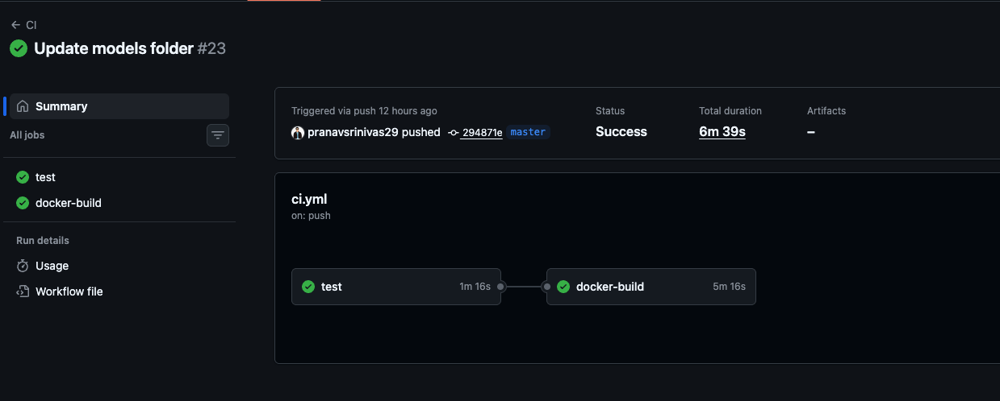
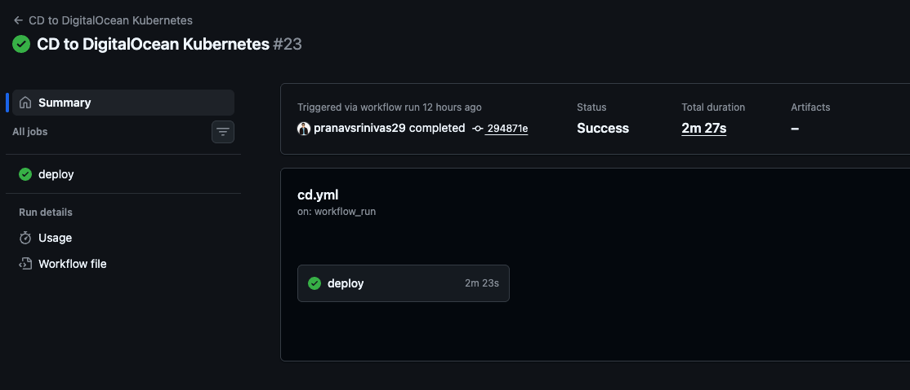
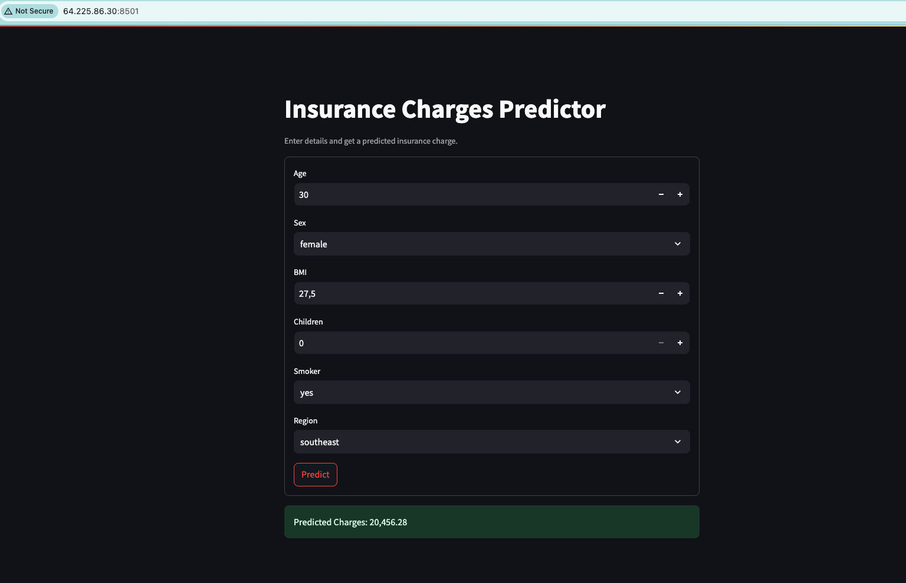
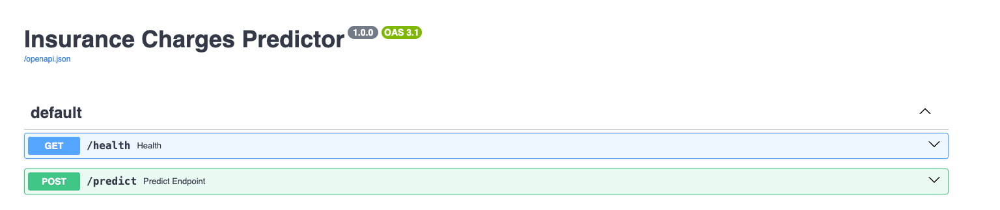
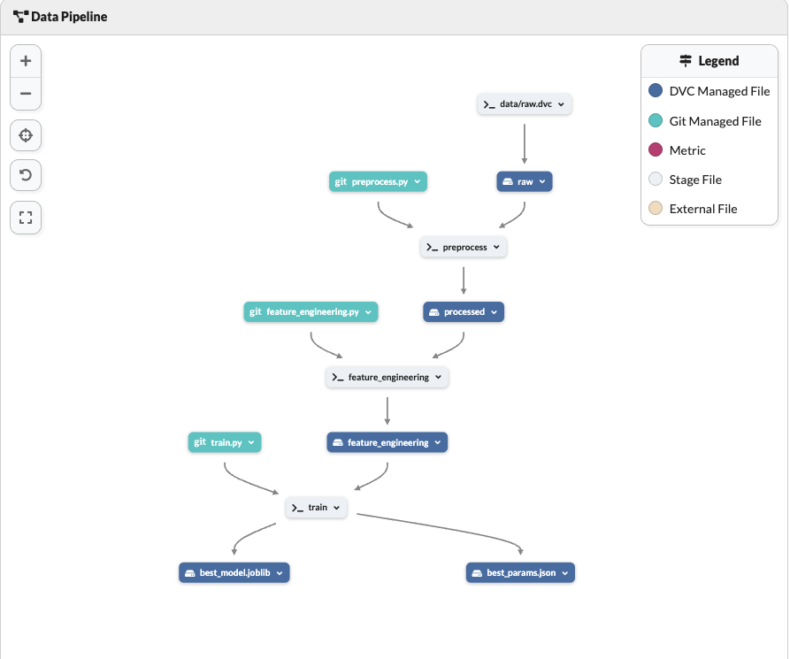
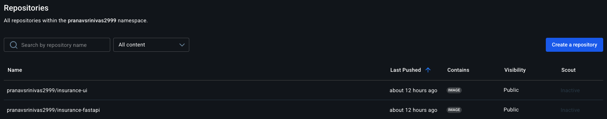
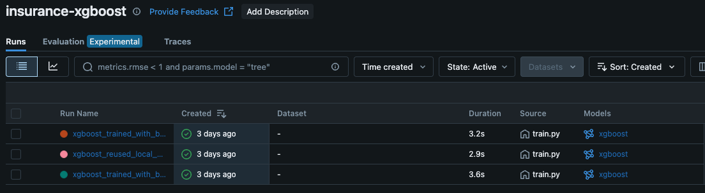

# 🧠 Medical Cost Predictor – Complete end-to-end MLOps Project

This end-to-end MLOps project predicts medical insurance charges using a trained machine learning model. It integrates modular components across:

- 🚀 Model APIs with **FastAPI**
- 🎛️ Interactive UI using **Streamlit**
- 🐳 Containerization with **Docker**
- ☸️ Scalable deployment on **Kubernetes**
- 🗃️ Artifact/version tracking with **DVC** + **Dagshub**
- 🔁 CI/CD via **GitHub Actions**

---
## ⚙️ Tech Stack
| Tool / Framework | Purpose                                                                  |
| ---------------- | ------------------------------------------------------------------------ |
| **Python**       | Core programming language for application logic and ML code              |
| **FastAPI**      | Backend API server for model inference                                   |
| **Streamlit**    | Frontend web UI for interactive predictions                              |
| **MLflow**       | Model tracking, versioning, and evaluation logging                       |
| **Docker**       | Containerization of services for reproducibility                         |
| **Kubernetes**   | Orchestration of containerized apps in production (via DigitalOcean)     |
| **DVC**          | Data version control for models, artifacts, and pipeline reproducibility |
| **Dagshub**      | Remote storage backend for DVC-tracked models/artifacts                  |
| **DockerHub**    | Remote container registry for storing Docker images                      |
| **DigitalOcean** | Cloud platform to host Kubernetes cluster for CI/CD deployment           |

---
## ⚙️ Setup & Installation

### 1. Clone Repo & Create Environment

```bash
git clone https://github.com/your-username/Medical-Cost-Predictor.git
cd mlop/e2e
conda create -n < virtual_env > python=3.11.9 -y
conda activate < virtual_env >
pip install -r requirements.txt
```

### 2. Pull Data & Artifacts with DVC
#### Ensure you are authenticated to DagsHub
# Set remote if not done
```bash
dvc remote modify origin --local auth basic
dvc remote modify origin --local user <your-dagshub-username>
dvc remote modify origin --local password <your-personal-access-token>

# Pull artifacts
dvc pull
```

🚀 Run Locally

▶️ FastAPI Backend and ▶️ Streamlit Frontend
```bash
uvicorn app.main:app --reload
streamlit run streamlit_app/app.py
```

🐳 Docker Commands

🔧 Build & Push Images
```bash
# FastAPI
docker build -f docker/serve.Dockerfile -t your-dockerhub/insurance-fastapi:latest .
docker push your-dockerhub/insurance-fastapi:latest

# Streamlit
docker build -f docker/streamlit.Dockerfile -t your-dockerhub/insurance-streamlit:latest .
docker push your-dockerhub/insurance-streamlit:latest
```

☸️ Kubernetes Deployment

✅ Apply Manifests
```bash
kubectl apply -f k8s/namespace.yaml
kubectl apply -f k8s/volumes.yaml
kubectl apply -f k8s/fastapi-deployment.yaml
kubectl apply -f k8s/streamlit-deployment.yaml
kubectl apply -f k8s/fastapi-service.yaml
kubectl apply -f k8s/streamlit-service.yaml
```

🔑 Create Secret for DVC (Dagshub)
```bash
kubectl create secret generic dagshub-secret \
  --from-literal=repo_url=https://dagshub.com/<user>/<repo>.dvc \
  --from-literal=username=<your-username> \
  --from-literal=password=<your-token> \
  -n mlops-system
```

🧪 CI/CD with GitHub Actions
- Auto build & push Docker images
- Trigger redeploy on main pushes
- Artifact caching with actions/cache

Your GitHub repo -> Settings -> Secrets and variables -> Actions
Set following secrets
```text
DOCKERHUB_USERNAME = <your-dockerhub-username>
DOCKERHUB_TOKEN = <ypur-dockerhub-token>

DIGITALOCEAN_ACCESS_TOKEN = <your-digital-access-token>

DVC_USER = <your-dvc-username>
DVC_PASSWORD = <your-dvc-token>

KUBECONFIG_DATA = <base64-encoded-kubeconfig content>
```

🔐 To Get KUBECONFIG_DATA (DigitalOcean Cluster)
1. Login & Create a Cluster:
- Go to https://cloud.digitalocean.com/kubernetes
- Create a cluster (name: mlops-cluster, region, node pool, etc.)
2. Connect to Cluster:
- On the cluster page, click “Actions → Download Config File” or run the CLI command:
```bash
doctl kubernetes cluster kubeconfig save <cluster-name>
```
3. Base64 Encode the Kubeconfig:
```bash
cat ~/.kube/config | base64 -w 0   # For Linux/macOS
```
4. Copy the entire one-line output and paste it into GitHub as:
```bash
KUBECONFIG_DATA = <base64_encoded_output>
```
#### CI/CD pipeline



#### UI


#### API


#### DVC & DagsHub


#### DockerHub


#### MLFlow

